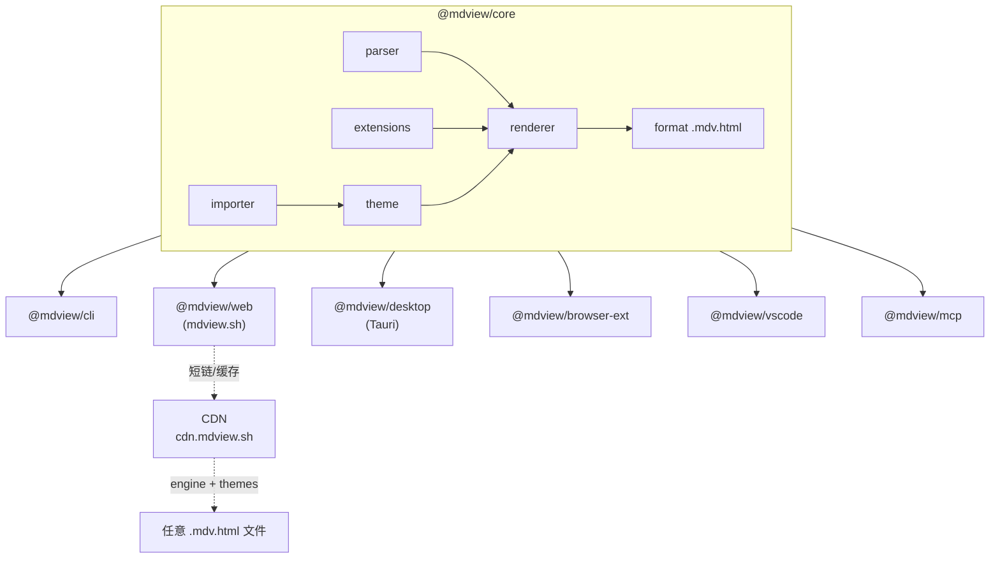

# mdview · 产品规划与架构设计

> Engine-first 的 Markdown 渲染 / 阅读 / 编辑生态。一份核心引擎，多端消费：桌面、Web、浏览器扩展、IDE 插件、CLI、MCP。

---

## 1. 产品愿景

mdview 不是又一个 Markdown 编辑器。它的核心是一套**可嵌入、可换肤、可扩展**的 Markdown 渲染引擎，以及围绕它构建的多端轻量消费者。

- 给"读 Markdown"这件事一个 Medium / Substack 级别的体验
- 给"分享 Markdown"一个像分享 CodePen 一样轻便的方式（短链、自渲染 HTML）
- 给 AI 一个标准化的 Markdown 美化通道（CLI / MCP）

短期目标：单人可维护的 MVP，跑通桌面端阅读器 + Web 短链预览，开源以拉新。

长期目标：成为「跨端 Markdown 渲染」事实上的轻量标准，通过主题市场 / AI 增强 / 团队功能等做增值收费。

---

## 2. 目标用户

| 用户          | 场景                       | 用 mdview 的理由                   |
| ------------- | -------------------------- | ---------------------------------- |
| 技术博客作者  | 写文档、自部署博客         | 一份 .md，多种主题，一键变美       |
| GitHub 用户   | 看陌生项目的 README        | 比 GitHub 自带渲染更沉浸、可换主题 |
| AI 重度使用者 | 让 AI 生成 .md 报告        | CLI / MCP 让 AI 输出直接美化       |
| IDE 用户      | VS Code / JetBrains 写 .md | 插件复用同一套渲染体验             |
| 内容分享者    | 想快速分享一段长文         | mdview.sh 短链 + 美化版            |

---

## 3. 差异化三支柱

mdview 的核心竞争力不在"做了什么"，而在"怎么做"。三个支柱：

### 3.1 Engine-first 架构

所有端共用 `@mdview/core`。新增端 = 写一个薄壳。这意味着：

- 主题 / 扩展语法在任何端都是一致的
- 单人维护可承担多端
- 第三方可以用引擎构建自己的产品（CMS、博客、文档站）

### 3.2 自渲染 HTML 格式（`.mdv.html`）

导出一个 HTML 文件，里面**主体仍是原始 Markdown**，由一个轻量 JS 在加载时渲染。详见 `02-Format-Spec.md`。

```html
<script src="https://cdn.mdview.sh/r/v1.js"></script>
<script type="text/x-mdview-source">
  # Hello World
</script>
```

价值：

- HTML 文件可单独分发、邮件、上传到任何静态托管
- **依然能用任意文本编辑器编辑里面的 Markdown**
- 渲染 JS 可换 → 风格可换
- 浏览器原生即可看，无需 mdview 客户端

### 3.3 极简沉浸式阅读

- 双击 `.md` → 一个无菜单栏、Medium 风格的窗口
- 不是编辑器（编辑器是红海），是阅读器（蓝海）
- 编辑能力作为可选项（按 `E` 切融合视图）

---

## 4. 功能范围（MVP / 1.0 / 2.0）

### MVP（Must）

1. `@mdview/core`：基础 Markdown 解析 + HTML 渲染（GFM 兼容）
2. 桌面端（Tauri）：双击 `.md` → 沉浸式阅读窗
3. 内置 2-3 个主题（默认 / Medium / GitHub）
4. Web 端 URL 预览：`mdview.sh/?url=<encoded>` 可看任何公网 .md

### 1.0（Should）

5. `.mdv.html` 自渲染格式 + 一键导出
6. mdview.sh 短链：`mdview.sh/abc123` → 渲染缓存的 .md
7. 主题切换器（前端组件）
8. 浏览器扩展：自动接管 GitHub raw .md 页面
9. VS Code 插件：复用同一引擎做 Live Preview
10. CLI：`mdview render foo.md > foo.html`

### 2.0（Could）

11. 主题导入器：Typora / Obsidian 主题 → mdview 主题
12. 内联扩展语法：`#ff0000` 色块、`<kbd>`、callout、徽章、进度条
13. 块级扩展：mermaid、math、chart 内联渲染
14. MCP server：让 Claude / 其他 AI 直接调 `render(markdown) → html`
15. 主题 marketplace（用户自定义 / 付费主题）
16. 编辑融合视图（左源右渲染，滚动同步）
17. AI 增强：自动 TOC、TL;DR、术语 hover、翻译

### Won't（暂不做）

- 知识管理 / 双向链接（避开 Obsidian 红海）
- 多人协作实时编辑（避开 HackMD / Notion）
- 私有云 / 笔记同步（运维成本高，单人扛不住）
- 移动端 App（性价比低）

---

## 5. 系统架构

### 5.1 分层

```
┌─────────────────────────────────────────────────────┐
│  端 / 消费者                                         │
│  Desktop / Web / Browser Ext / VS Code / CLI / MCP  │
└─────────────────────────────────────────────────────┘
                         ↓ 都依赖
┌─────────────────────────────────────────────────────┐
│  @mdview/core （纯 TypeScript，零运行时依赖）        │
│  ├─ parser    Markdown → AST                        │
│  ├─ extensions  自定义语法插件                       │
│  ├─ renderer  AST → HTML                            │
│  ├─ theme     主题加载 / 切换                        │
│  ├─ format    .mdv.html 序列化 / 反序列化            │
│  └─ importer  Typora / Obsidian 主题转换             │
└─────────────────────────────────────────────────────┘
                         ↓ 基于
┌─────────────────────────────────────────────────────┐
│  markdown-it（解析底座，生态成熟，插件机制清晰）      │
└─────────────────────────────────────────────────────┘
```

### 5.2 Mermaid 架构图



### 5.3 Monorepo 结构（建议 pnpm workspaces）

```
mdview/
├── packages/
│   ├── core/              # @mdview/core - 引擎核心
│   ├── themes/            # @mdview/themes - 内置主题包
│   ├── cli/               # @mdview/cli - 命令行
│   ├── web/               # @mdview/web - 浏览器 UMD/ESM 包
│   ├── desktop/           # Tauri 桌面端
│   ├── browser-ext/       # 浏览器扩展
│   ├── vscode/            # VS Code 插件
│   └── mcp/               # MCP server
├── apps/
│   └── mdview-sh/         # mdview.sh 服务端 (preview + 短链)
├── docs/                  # 文档站
└── pnpm-workspace.yaml
```

---

## 6. 技术栈分析

### 6.1 桌面端：Tauri vs Electron

| 维度        | Tauri 2                                                               | Electron                | 对你的权重                                         |
| ----------- | --------------------------------------------------------------------- | ----------------------- | -------------------------------------------------- |
| 安装包大小  | 3–10 MB                                                               | 80–150 MB               | ★★★（你定位"极简沉浸"）                            |
| 冷启动      | < 1s                                                                  | 2–3s                    | ★★★（双击即看是核心体验）                          |
| 内存占用    | 50–100 MB                                                             | 200–400 MB              | ★★                                                 |
| 跨端一致性  | 用系统 WebView（Mac WebKit / Win WebView2 / Linux WebKitGTK），有差异 | 自带 Chromium，完全一致 | ★（渲染 Markdown 几乎不用现代 CSS 特性，差异可控） |
| 学习成本    | 后端要写一点 Rust                                                     | 全 JS                   | ★                                                  |
| 生态 / 插件 | 较新但活跃                                                            | 非常成熟                | ★                                                  |
| 自动更新    | 内置                                                                  | 需配 electron-updater   | ★                                                  |

**结论：Tauri**。你的需求里，包体和启动速度是核心体验，Electron 与"沉浸阅读器"定位有冲突。后端只需读文件、注册文件关联、调系统 webview，Rust 代码量极少（<100 行）。

WebView 一致性问题的兜底：用 markdown-it + Tailwind 风格的 CSS reset，避开 `:has()`、`@container`、复杂 CSS 嵌套，可以把跨 WebView 差异压到肉眼不可见。

### 6.2 整体技术选型（已确认）

| 模块                     | 选型                                         | 理由                                                       |
| ------------------------ | -------------------------------------------- | ---------------------------------------------------------- |
| 引擎核心 `@mdview/core`  | TypeScript + markdown-it                     | 插件生态最强，AST 友好，单包 size < 50KB                   |
| UI 组件库 `@mdview/ui`   | React + Tailwind                             | 桌面 / Web / VS Code 共用同一套主题切换器 / TOC / 设置面板 |
| 桌面端 `@mdview/desktop` | **Tauri 2 + Vite + React**                   | 包体小、启动快、生态成熟、可复用 UI 组件                   |
| Web 端 `apps/mdview-sh`  | **Astro + React islands**                    | 预览页 SSG 吃 SEO，交互组件以孤岛形式复用桌面端 React      |
| Web 服务端               | Cloudflare Workers + R2 + D1                 | 免运维，全球 edge，免费额度足够前期                        |
| VS Code 插件             | TS + Webview API + React                     | 直接 import `@mdview/core` 与 `@mdview/ui`                 |
| 浏览器扩展               | Plasmo 或手写 manifest v3                    | 跨 Chrome / Firefox                                        |
| 包管理                   | pnpm + workspaces                            | monorepo 标配                                              |
| 文档站                   | Astro（同 Web 端）                           | 顺便吃自家狗粮（用 mdview 渲染）                           |
| CSS 策略                 | Tailwind 用于产品 UI；主题用纯 CSS（不污染） | 主题 CSS 必须能脱离 Tailwind 独立工作                      |

### 6.3 前端构建工具选择

桌面端 / Web 端 / VS Code Webview 三处都需要前端打包工具，建议**统一使用 Vite**。下面是评估过的备选：

| 工具             | 类型                         | 评价                                                                     |
| ---------------- | ---------------------------- | ------------------------------------------------------------------------ |
| **Vite**（选用） | esbuild dev + Rollup build   | 官方 Tauri 模板首选；HMR 极快；React 生态零配置；后续可无缝升级 Rolldown |
| Rsbuild          | Rust 实现的 webpack 兼容栈   | 性能与 Vite 持平；webpack 用户友好；生态小一些；可作为后期备选           |
| Parcel 2         | 零配置                       | 简单但插件生态弱，不适合主题市场 / 扩展系统的复杂场景                    |
| Rolldown-Vite    | Rolldown 替换 Rollup 的 Vite | Vite 的未来形态；目前未稳定；建议等 Vite 自动升级                        |
| Webpack 5        | 老牌标准                     | 配置复杂 HMR 慢，不推荐新项目使用                                        |
| esbuild（裸用）  | 极速底层打包器               | 没有 HMR / Fast Refresh，要自己拼，单人开发不划算                        |
| Bun / Turbopack  | 一体化 runtime / Vercel 出品 | 不成熟或仅服务 Next.js，不考虑                                           |

**为什么坚定选 Vite**：

- Tauri 官方模板第一档支持
- HMR 对开发主题系统至关重要（改 CSS 几乎零延迟）
- 同一份配置可在桌面端 / Astro Web / VS Code Webview 间复用
- Rolldown 升级路径平滑
- 生态最大（`vite-plugin-react` / `vite-plugin-tailwind` / `vite-plugin-svgr` ...）

**何时换栈**：唯一可预见的迁移触发条件是 build 时间成为瓶颈（mdview 体量极不可能），届时平迁 Rsbuild，概念一致。

### 6.4 React 选择的影响评估

桌面端用 React 是综合考量，下面把权衡讲清楚：

| 维度            | 影响                                                 | 评估                                                |
| --------------- | ---------------------------------------------------- | --------------------------------------------------- |
| 安装包大小      | React + ReactDOM ≈ 45KB gzipped，比 Svelte (~3KB) 大 | Tauri 总包仍 5–8 MB，Electron 是 80+ MB，差距可接受 |
| 启动速度        | 比 Svelte 多 ~30-80ms 首屏                           | 用户感知不到                                        |
| 渲染性能        | 与 Svelte 相当（在我们这种文档场景下）               | 无差异                                              |
| 生态            | CodeMirror / Monaco / Radix UI 等 React 适配最齐     | **加分项**                                          |
| 学习成本 / 招人 | React 是事实上的标准                                 | **加分项**                                          |
| 跨端组件复用    | 与 Web 端 (Astro islands) / VS Code Webview 完全共用 | **核心加分项**                                      |

> 唯一代价是包体多 ~40KB，换来跨端组件复用 + 生态便利，性价比高。

---

## 7. 路线图（按阶段，不按周）

> 单人开发，每个阶段做完都可以独立发布、独立体现价值。完成一个阶段后再开下一个。

### Phase 0 · 地基

- monorepo 搭建、CI、license（MIT）
- `@mdview/core` 雏形：能 `render(md) → html`
- 1 个默认主题
- 单元测试 + 1 套渲染快照

### Phase 1 · 桌面端阅读器（首发）

- Tauri 桌面端：双击 `.md` → 沉浸式阅读窗
- 注册成 `.md` 默认打开方式（可选）
- 内置 3 个主题，菜单可切
- Drag-drop 打开
- 发布到 GitHub Release，写一篇博客 + 配图发 Hacker News / V2EX / 即刻

**里程碑信号**：有人在社交媒体晒截图

### Phase 2 · Web 短链预览

- `mdview.sh` 域名上线
- `mdview.sh/?url=<encoded>` 渲染任意公网 .md
- `mdview.sh/abc123` 短链（粘贴 URL 后生成短链 + OG 卡片）
- 滥用防护：URL 白名单 / rate limit / sanitize

**里程碑信号**：有人在群里 / Twitter 用 mdview.sh 链接分享 README

### Phase 3 · 自渲染 HTML 格式

- `.mdv.html` 格式定稿（见 `02-Format-Spec.md`）
- 桌面端 / Web 端"导出为 .mdv.html"
- `cdn.mdview.sh` 上线 engine + themes
- 写一篇博客《.mdv.html: HTML 也能是 Markdown》

**里程碑信号**：format spec 被有人 fork / 实现替代渲染 JS

### Phase 4 · 浏览器扩展 + VS Code 插件

- 浏览器扩展：在 raw.githubusercontent.com 等域名上自动接管渲染（这是流量入口，几乎不要钱）
- VS Code 插件：替换默认 Markdown Preview
- CLI 包：`npx @mdview/cli render foo.md`

**里程碑信号**：扩展商店日活 1k+

### Phase 5 · 主题市场 + 主题导入

- Typora 主题导入器（CSS 转换映射表）
- Obsidian 主题导入器
- 用户自建主题：可视化编辑器 + 分享链接
- 主题画廊页

**里程碑信号**：社区贡献第一个非内置主题

### Phase 6 · AI 增强 + MCP

- MCP server：暴露 `render` / `to_mdv_html` 工具给 Claude
- AI Skill / CLI：让 AI 一键把生成的 .md 美化成 .mdv.html
- AI 增强阅读：自动 TOC、TL;DR、术语 hover

**里程碑信号**：有人写了"用 Claude + mdview 搭了个个人博客"教程

### Phase 7 · 增值 / 商业化

- 主题 marketplace 付费
- 私有 URL 预览（带 token 拉私有 GitHub）
- 团队空间、自定义域名
- 仍然保持核心引擎开源

---

## 8. 优先级矩阵

> 价值 = 用户感知收益；成本 = 你一个人的开发负担

| 功能                        | 价值         | 成本 | 综合优先级 |
| --------------------------- | ------------ | ---- | ---------- |
| 桌面端双击即看              | 高           | 中   | **P0**     |
| 内置 2-3 主题               | 高           | 低   | **P0**     |
| Web URL 预览                | 高           | 中   | **P0**     |
| 短链 + OG 卡片              | 中           | 低   | P1         |
| .mdv.html 自渲染格式        | 高（差异化） | 中   | **P1**     |
| 浏览器扩展接管 GitHub       | 高（拉新）   | 中   | P1         |
| VS Code 插件                | 中           | 低   | P1         |
| CLI 包                      | 中           | 低   | P1         |
| 内联色块 / kbd / callout    | 中           | 低   | P2         |
| 内联 mermaid / math / chart | 中           | 低   | P2         |
| Typora 主题导入             | 高           | 高   | P2         |
| 编辑融合视图                | 中           | 中   | P2         |
| MCP server                  | 中（信号大） | 低   | P2         |
| 主题市场                    | 中           | 高   | P3         |
| AI 增强阅读                 | 中           | 中   | P3         |
| 团队 / 付费                 | 高（商业）   | 高   | P3         |

---

## 9. 风险与缓解

| 风险                                        | 缓解                                                               |
| ------------------------------------------- | ------------------------------------------------------------------ |
| 同质化（GitHub / Typora / Obsidian 渗透高） | 集中火力打"自渲染 HTML + 短链分享"，这是别人没有的角度             |
| 单人维护多端疲劳                            | Engine-first 架构 + 端壳尽可能薄；Phase 制完成才开下一个           |
| WebView 跨平台 CSS 差异                     | 主题用保守 CSS，CI 跑 Playwright 截图比对                          |
| 短链服务被滥用做钓鱼                        | 域名白名单 / 内容指纹去重 / 文本中关键词检测                       |
| 商业化路径模糊                              | Phase 7 之前不焦虑，先验证 PMF；后续靠主题市场 + 私有 + 团队三条腿 |
| 开源后被大厂"白嫖"                          | 这是好事 —— 前期就是要被白嫖才能传播；商业化能力放在 SaaS 服务端   |

---

## 10. 决策日志

| 日期       | 决策                                                  | 理由                                                                                            |
| ---------- | ----------------------------------------------------- | ----------------------------------------------------------------------------------------------- |
| 2026-05-09 | 桌面端选 Tauri 而非 Electron                          | 包体 / 启动 / 内存全面优于，符合"极简"定位                                                      |
| 2026-05-09 | 引擎选 markdown-it 而非 remark                        | 插件机制清晰、社区活跃、AST 简单                                                                |
| 2026-05-09 | Engine-first 多端复用                                 | 单人维护多端的唯一可行方式                                                                      |
| 2026-05-09 | 定位转为"阅读器优先"                                  | 编辑器红海，阅读器蓝海                                                                          |
| 2026-05-09 | 推出 .mdv.html 自渲染格式                             | 真正独有差异化，竞品没有                                                                        |
| 2026-05-09 | 先开源 + freemium 路线                                | 开源拉新，主题市场 / AI / 团队功能付费                                                          |
| 2026-05-09 | 主域名 mdview.sh，备 mdview.md                        | 短、关联强、`.sh` 极客感强；`.md` 做品牌防御                                                    |
| 2026-05-09 | 桌面端 UI 框架选 React + Tailwind                     | 跨端组件复用收益 > 包体代价                                                                     |
| 2026-05-09 | Web 端用 Astro + React Islands                        | SEO + 性能 + 复用桌面端 React 组件                                                              |
| 2026-05-09 | `.mdv.html` 默认 Progressive 形态                     | 单文件可看 + 引擎可升级                                                                         |
| 2026-05-09 | 主题 = CSS + JSON 元数据，不开 JS 钩子                | 安全、可审核、用户提交主题门槛低                                                                |
| 2026-05-09 | MVP 短链免登录 + 强限流                               | 降低使用门槛，登录功能延后到证明需求后再加                                                      |
| 2026-05-09 | 自定义扩展语法不开放，只内置白名单                    | XSS / 解析复杂度风险                                                                            |
| 2026-05-09 | 文件后缀策略：`.md` + `.mdv.html`，可选 `.mdv`        | 生态兼容优先，`.mdv` 仅作 IDE 关联标识                                                          |
| 2026-05-09 | 元数据升格为"演出说明"（Metadata as Stage Direction） | 见 02 文档第 3 章，作为产品差异化亮点                                                           |
| 2026-05-09 | 前端构建工具统一选 Vite                               | Tauri 模板首选 / HMR 极快 / 跨端配置可复用 / Rolldown 升级路径平滑                              |
| 2026-05-09 | `.mdv.html` 三种形态全部一等公民支持                  | Progressive / Minimal / Standalone 均提供，导出对话框三选一，CLI 支持 `--form all` 一次输出三份 |
| 2026-05-09 | 引擎版本支持 pinned 与 latest 双轨 + SRI              | 兼顾"自动升级"和"长期归档"两类需求                                                              |

---

## 11. 命名 / 域名 / 品牌矩阵

### 11.1 主品牌

- **品牌名**：`mdview`（小写，无空格，全场景一致）
- **Slogan 候选**（待定）：
  - "Make Markdown look the way you want."
  - "A reader-first home for Markdown."
  - "Markdown, beautifully rendered. Anywhere."
- **Logo 风格**：以"M"或"MD"为主体的极简单色 logo；阅读器气质为先（避免太程序员化）
- **品牌色暂定**：暗中性灰 + 一个高饱和强调色（具体看主题画廊定）

### 11.2 域名规划

#### 11.2.1 主域名

| 域名            | 用途                                      | 状态                         |
| --------------- | ----------------------------------------- | ---------------------------- |
| **`mdview.sh`** | 主站、品牌门面、所有产品入口              | **必抢**                     |
| `mdview.md`     | 品牌防御 + 备用，301 重定向到 `mdview.sh` | 强烈建议同时抢               |
| `mdview.com`    | 长期目标（如商业化扩大）                  | 可暂缓，过两年再视情况谈收购 |

#### 11.2.2 二级域名（基于 mdview.sh）

| 子域名             | 用途                                            | 启用阶段 |
| ------------------ | ----------------------------------------------- | -------- |
| `mdview.sh`        | 主站：landing + URL 预览 + 短链入口             | Phase 2  |
| `cdn.mdview.sh`    | 静态资源：engine.js / themes.css / 字体 / 扩展  | Phase 2  |
| `r.mdview.sh`      | 短链跳转（可选，亦可直接用 `mdview.sh/{slug}`） | Phase 2  |
| `docs.mdview.sh`   | 文档站（用 mdview 自渲染，吃自家狗粮）          | Phase 4  |
| `themes.mdview.sh` | 主题市场 / 画廊                                 | Phase 5  |
| `s.mdview.sh`      | 私有 / 共享空间（登录后）                       | 长期     |
| `api.mdview.sh`    | 程序接口（让第三方应用调用渲染）                | 看情况   |
| `play.mdview.sh`   | 在线 playground（试玩主题、扩展语法）           | 看情况   |
| `status.mdview.sh` | 服务可用性看板                                  | 上规模后 |

#### 11.2.3 短链规则

- **格式**：`https://mdview.sh/{slug}`（默认）或 `https://r.mdview.sh/{slug}`
- **slug 长度**：6 位 base62（约 568 亿组合，万年够用）
- **匿名短链**：30 天未访问自动过期；每 IP / 天限 N 个；不可编辑
- **登录短链（后续）**：永久；可编辑源码；可设私有；可绑自定义封面 / OG
- **OG 卡片 URL**：`https://mdview.sh/{slug}/og` 自动生成 1200×630 PNG
- **嵌入 iframe URL**：`https://mdview.sh/embed/{slug}?theme=medium`
- **二维码 URL**：`https://mdview.sh/{slug}/qr`

#### 11.2.4 URL 预览参数约定

- `https://mdview.sh/?url=<encoded-md-url>` 直接渲染任意公网 .md
- `https://mdview.sh/?url=<...>&theme=medium` 指定主题
- `https://mdview.sh/?url=<...>&extensions=mdv:color,mdv:callout` 启用扩展
- `https://mdview.sh/preview/{shortcode}` 等同于 `/{slug}` 但走 GET 缓存友好路径

#### 11.2.5 CDN 资源 URL 约定

```
cdn.mdview.sh/
├── r/                       # renderer (engine.js)
│   ├── v1.js                # 当前主版本，长期稳定
│   ├── v1.min.js            # 压缩版
│   └── v1-full.js           # 含 mermaid / chart / katex 等重型扩展
├── themes/
│   ├── default.css
│   ├── medium.css
│   ├── github.css
│   ├── dark.css
│   └── community/           # 用户提交、审核通过的主题
│       └── {author}/{theme}.css
├── ext/
│   ├── mermaid.js
│   ├── katex.js
│   └── chart.js
└── fonts/
    ├── charter.woff2
    └── ...
```

### 11.3 产品矩阵（统一前缀，认知一致）

| 产品形态         | 显示名                                 | 安装包 / Bundle ID   | 包名 / Marketplace ID                               |
| ---------------- | -------------------------------------- | -------------------- | --------------------------------------------------- |
| 桌面端 App       | **mdview**                             | `sh.mdview.desktop`  | macOS App Store: `mdview`（如上架）                 |
| Web 站           | **mdview.sh**                          | —                    | 域名                                                |
| 浏览器扩展       | **mdview for Chrome / Firefox / Edge** | `sh.mdview.browser`  | Chrome Web Store: "mdview - Beautiful Markdown"     |
| VS Code 插件     | **mdview**                             | —                    | Marketplace: `mdview.mdview`                        |
| JetBrains 插件   | **mdview**                             | `sh.mdview.intellij` | JetBrains Marketplace                               |
| CLI              | `mdview` / `mdv`（短别名）             | —                    | npm: `@mdview/cli`，bin: `mdview` 与 `mdv`          |
| 引擎核心         | —                                      | —                    | npm: `@mdview/core`                                 |
| UI 组件库        | —                                      | —                    | npm: `@mdview/ui`                                   |
| 主题包           | —                                      | —                    | npm: `@mdview/themes`、`@mdview/themes-typora-pack` |
| MCP server       | —                                      | —                    | npm: `@mdview/mcp`                                  |
| AI Skill         | mdview Markdown beautifier             | —                    | `mdview-skill`                                      |
| 自渲染格式       | `.mdv.html`                            | —                    | 协议名: `mdview-format`                             |
| 源码标识（可选） | `.mdv`                                 | —                    | IDE 关联标识                                        |

### 11.4 品牌防御 / 占名清单（按优先级）

> 在动手写代码前花 1-2 小时把这些占住，几十美金的事情，价值很大。

**P0 · 立刻**

- [ ] `mdview.sh` 域名（Porkbun / Namecheap，~$30-50/年）
- [ ] `mdview.md` 域名（同上，~$50-90/年）
- [ ] GitHub org `mdview`（如已被占，退到 `mdview-sh` 或 `mdview-app`）
- [ ] npm scope `@mdview`（用 `npm org create mdview`）
- [ ] npm 包名 `mdview`（保留，CLI 入口）

**P1 · 一周内**

- [ ] Twitter / X：`@mdview` 或 `@mdview_sh`
- [ ] ProductHunt 账号
- [ ] 微信公众号（如准备做中文社区）
- [ ] Discord 服务器或 Slack（社区入口）

**P2 · 上线前**

- [ ] Chrome Web Store 开发者账号
- [ ] VS Code Marketplace publisher
- [ ] JetBrains Marketplace 账号
- [ ] macOS Apple Developer ID（公证 / Notarization 必需）
- [ ] Windows 代码签名证书（可选，但用户更信任）

**P3 · 长期**

- [ ] `mdview.com` 谈判收购（视品牌增长）
- [ ] 中国境内 ICP 备案（如做大陆市场）
- [ ] 商标注册（图形商标，文字商标弱）

---

## 12. 下一步具体动作（可执行清单）

> 这些是马上能做的，不带时间估计。按顺序做掉这一批，Phase 0 就完成了。

1. 完成 §11.4 中所有 P0 占名（域名 / GitHub / npm）
2. 创建 monorepo 仓库 `kip2team/mdview`，license MIT
3. `pnpm init -w` 搭 monorepo 骨架，建 `packages/core` `packages/ui` `packages/themes`
4. 基于 markdown-it 实现 `core.render(md, opts) → { html, meta }`，含 front matter 解析
5. 写第一个主题 CSS（默认主题，克隆 GitHub README 风格）
6. 用 Tauri 2 + Vite + React 搭桌面端壳，把 core 跑起来，能双击 .md 渲染
7. 写一个 README 告诉别人"这是什么"，准备好发布素材（截图 / GIF）
8. 把 02 文档的 `.mdv.html` Format Spec 锁定到 v0.1，然后据此实现导出功能

---

## 附 A · 与竞品的差异化论证

| 竞品                    | 强在哪               | 我们的差异                                           |
| ----------------------- | -------------------- | ---------------------------------------------------- |
| Typora                  | 所见即所得、主题最美 | 我们是阅读器优先 + 多端引擎 + 自渲染 HTML            |
| Obsidian                | 双向链接 + 插件      | 我们不做知识管理，只做"看 / 分享"                    |
| GitHub 自带渲染         | 免费、零摩擦         | 我们更美 / 可换主题 / 离线可用 / 可分享独立链接      |
| VS Code 默认 Preview    | 开发者顺手           | 我们的 VS Code 插件复用同一引擎 + 主题，跨端体验一致 |
| HackMD / StackEdit      | 在线协作 / 编辑      | 我们极简、阅读优先、`.mdv.html` 可离线               |
| markdownlivepreview.com | 简单粗暴             | 我们有主题 / 短链 / OG / 私有 URL                    |

---

## 附 B · 开放问题进度

### 已决定（2026-05-09）

| 问题                 | 决议                                     |
| -------------------- | ---------------------------------------- |
| 桌面端 UI 框架       | React + Tailwind                         |
| Web 端框架           | Astro + React Islands                    |
| 主题包格式           | 纯 CSS + 同名 JSON 元数据；不开 JS 钩子  |
| 自定义扩展语法       | MVP 不开放，仅内置白名单                 |
| `.mdv.html` 默认形态 | Progressive 渐进增强                     |
| 短链登录             | MVP 免登录 + 强限流；登录功能延后        |
| 主域名               | mdview.sh（同时抢 mdview.md 防御）       |
| 文件后缀             | `.md` + `.mdv.html`（必要），`.mdv` 可选 |

### 仍待定（不阻塞 Phase 0-1）

1. **品牌 slogan 终稿**：在三个候选里选一个，或重新写
2. **logo 设计**：风格倾向（极简文字 / 抽象符号 / 拟物纸张）
3. **暗色模式触发策略**：跟随系统 / 文档 metadata 指定 / 用户开关，三者优先级
4. **桌面端 onboarding**：首次启动是否给 5 秒引导动画？还是直接打开示例 .md？
5. **主题市场分成模式**：作者分成比例、审核标准（这个非常远，先记着）
6. **是否做企业内部部署**：自托管 mdview.sh，是商业化重要一环（Phase 7+）

### 暂不考虑

- 实时多人协作（避开 HackMD / Notion 红海）
- 笔记同步 / 知识管理（避开 Obsidian / Notion）
- 自有图床 / 媒体托管（运维负担大，复用 GitHub / Cloudinary 即可）
