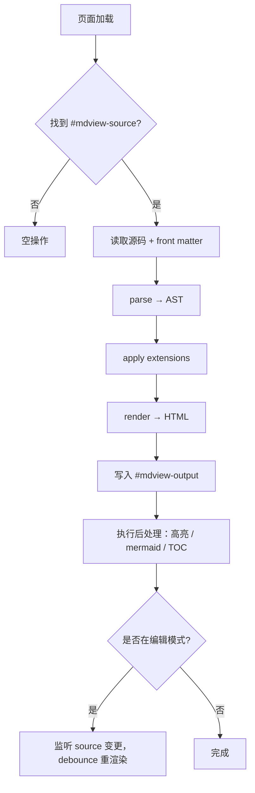

# mdview Format Spec · `.mdv.html`

> 一种"自渲染 HTML"格式：HTML 文件主体仍是原始 Markdown，加载时由轻量 JS 渲染。可单独分发、可任意编辑器编辑、可换风格。

版本：v0.1 草稿

---

## 1. 设计哲学

直接编辑生成的 HTML 很痛苦（嵌套 div、escape、类名）。但如果一个 HTML 文件**主体内容就是原始 Markdown**，只是外面包了一层 `<script>`，那它既能被浏览器直接打开渲染，又能被任何文本编辑器当 Markdown 编辑。

三个目标：

1. **可分发**：单文件，邮件 / U盘 / 任意静态托管即可访问
2. **可编辑**：用 VS Code / Vim / Notepad 打开后，看到的是 Markdown 源码
3. **可换肤**：渲染 JS 和主题 CSS 都是外部资源，换一个 URL 就换一个风格

### 1.1 Metadata as Stage Direction（演出说明）★ 核心差异化

**这是 mdview 与所有现有 Markdown 工具最关键的不同**。

传统 Markdown 的 front matter（Jekyll / Hugo / Obsidian 各家）是"工具读取的属性"——谁渲染就谁解释，渲染结果与元数据的关系是黑盒。结果就是：同一个 `.md` 在 GitHub、Typora、Notion 里看起来完全不同，作者意图被各种工具改写。

mdview 把元数据**升格为"演出说明"**：作者在源码里说明这份文档**应该怎么呈现**（主题、字体、行宽、扩展、品牌色…），任何兼容 mdview 的端打开都看到一致的演出。

```yaml
---
mdview: 1 # 协议版本（必填）
title: 我的文章
theme: medium # 主题
font: charter # 字体
fontSize: 18px
maxWidth: 720px
lineHeight: 1.7
toc: true # 自动目录
toc.position: right
cover: ./cover.jpg # 封面图
og.image: auto # 自动生成分享图
codeTheme: dracula # 代码高亮主题
extensions:
  - mdv:color
  - mdv:callout
  - mdv:mermaid
brand:
  primary: '#ff6b35' # 影响链接 / 标题色
  accent: '#004e89'
---
# 正文从这里开始
```

这个机制的价值：

- **作者意图的便携性**：作者在写文章时定下的"它应该长什么样"会跟着源码走
- **跨端一致**：桌面 / Web / VS Code / 浏览器扩展打开同一份 .md，看到同一个演出
- **零运行时配置**：用户不需要"先设置一遍工具再看"
- **AI 友好**：AI 输出 `.md` 时只需要在 front matter 里写好风格意图，下游就能正确呈现
- **降级友好**：不识别这套约定的工具（如 GitHub）依然能把 `.md` 当普通 markdown 渲染，只是失去样式信息

详细的元数据 schema 见 §3.4 与 §3.5。

### 1.2 与新格式的关系

mdview **不创造新文件格式**。它定义的是一套约定：

```
   .md (源码，纯 markdown，到哪都能看)
        │ + mdview 元数据约定 + mdview 扩展语法
        ↓
   .mdv.html (分发格式，浏览器原生可看 + 自带主题)
```

| 文件           | 是什么                                                                 | 定位                       |
| -------------- | ---------------------------------------------------------------------- | -------------------------- |
| `foo.md`       | 普通 markdown 源                                                       | 主源码格式，跨工具兼容     |
| `foo.mdv`      | mdview 风味 markdown（含元数据 + 扩展语法）—— 实质就是 .md，仅后缀不同 | 可选，仅作 IDE 关联标识    |
| `foo.mdv.html` | 自渲染分发格式                                                         | 单文件分享、离线、邮件附件 |

`.mdv.html` 在「可编辑性 + 可换肤 + 单文件分发」这三个维度同时拿满，是当前没有竞品的位置。

---

## 2. 文件结构

### 2.1 极简形态（Minimal）

````html
<!DOCTYPE html>
<html lang="en" data-mdview="0.1">
<head>
  <meta charset="UTF-8">
  <title>Untitled</title>
  <link rel="stylesheet" href="https://cdn.mdview.sh/themes/default.css">
  <script src="https://cdn.mdview.sh/r/v1.js" defer></script>
</head>
<body>
  <script type="text/x-mdview" id="mdview-source">
# Hello World

This is **mdview** rendering markdown directly from inside an HTML file.

- bullet 1
- bullet 2

```js
console.log("hi");
````

  </script>
  <main id="mdview-output"></main>
</body>
</html>
```

特点：

- 体积约 500 字节 + Markdown 内容
- 必须联网（依赖 CDN 上的 engine 和 theme）
- 任何主流编辑器打开都能看到 Markdown 源码

### 2.2 渐进增强形态（Progressive）

```html
<!DOCTYPE html>
<html lang="en" data-mdview="0.1">
  <head>
    <meta charset="UTF-8" />
    <title>My Article</title>
    <link rel="stylesheet" href="https://cdn.mdview.sh/themes/medium.css" />
    <script src="https://cdn.mdview.sh/r/v1.js" defer></script>
  </head>
  <body>
    <script type="text/x-mdview" id="mdview-source">
      # My Article
      content here...
    </script>
    <main id="mdview-output">
      <!-- 服务端预渲染的 HTML，无 JS 也能看 -->
      <h1>My Article</h1>
      <p>content here...</p>
    </main>
  </body>
</html>
```

特点：

- `#mdview-output` 已经预渲染好 HTML
- 即使禁用 JS / CDN 挂掉也能看
- JS 加载后会**重渲染**以应用动态特性（语法高亮、mermaid、TOC 等）
- 推荐作为默认导出形态

### 2.3 离线形态（Standalone）

```html
<!DOCTYPE html>
<html lang="en" data-mdview="0.1">
  <head>
    <meta charset="UTF-8" />
    <title>Offline Doc</title>
    <style>
      /* 内嵌主题 CSS，约 5-15 KB */
      body { font-family: ui-sans-serif, system-ui; ... }
      ...
    </style>
    <script>
      /* 内嵌引擎 JS，约 30-80 KB（minified + gzipped） */
      !function(){...}()
    </script>
  </head>
  <body>
    <script type="text/x-mdview" id="mdview-source">
      # Offline doc
      完全离线可看。
    </script>
    <main id="mdview-output"></main>
  </body>
</html>
```

特点：

- 单文件无依赖，离线可看
- 体积约 80-150 KB + Markdown
- 适合归档、邮件附件、对网络不放心的场景

### 2.4 三种形态对照

| 形态        | 体积         | 联网要求                        | 风格切换              | 推荐场景                  |
| ----------- | ------------ | ------------------------------- | --------------------- | ------------------------- |
| Minimal     | < 1 KB + md  | 必须                            | 极方便（改 URL 即可） | 临时分享、博客 CMS        |
| Progressive | < 5 KB + md  | 不必（首屏） / 必须（动态特性） | 方便                  | **默认导出 / 大多数场景** |
| Standalone  | 100 KB+ + md | 不必                            | 重新导出              | 归档、离线、企业内网      |

### 2.5 三种形态都是一等公民（用户可选）

mdview 不强制选择任一形态——**三种全部官方支持**，由用户按场景挑。导出入口暴露统一的选项。

#### 2.5.1 桌面端 / Web 端导出对话框

```
┌─────── 导出为 .mdv.html ───────────────────┐
│                                             │
│  ◉ Progressive  (推荐 · ~5 KB)              │
│    单文件可看，引擎和主题来自 CDN，可升级    │
│                                             │
│  ○ Minimal      (~1 KB)                     │
│    最小体积；必须联网才能渲染                │
│                                             │
│  ○ Standalone   (~120 KB)                   │
│    完全离线，归档友好；体积较大              │
│                                             │
│  引擎版本:  [v1 (latest)  ▾]                 │
│             v1.0.3 (pinned)                  │
│             v1 (latest, 自动升级)            │
│                                             │
│  主题:      [Medium        ▾]                │
│  ☑ 包含 Subresource Integrity 校验           │
│  ☐ 内嵌图片为 base64                          │
│                                             │
│              [取消]  [导出]                  │
└─────────────────────────────────────────────┘
```

#### 2.5.2 CLI 标志

```bash
# 导出某一种形态
mdview export foo.md --form progressive   # 默认
mdview export foo.md --form minimal
mdview export foo.md --form standalone

# 同时导出三种
mdview export foo.md --form all
# → foo.minimal.mdv.html
# → foo.progressive.mdv.html
# → foo.standalone.mdv.html

# 引擎版本固定
mdview export foo.md --form progressive --engine v1.0.3

# 内嵌资源
mdview export foo.md --form standalone --inline-images --inline-fonts
```

#### 2.5.3 Web 端 / 短链生成

`mdview.sh` 在生成短链时也提供形态选择，并允许用 URL 参数覆盖：

```
mdview.sh/{slug}?form=standalone   # 拉取 standalone 版本
mdview.sh/{slug}.minimal.mdv.html  # 直接下载 minimal 文件
```

#### 2.5.4 表单选择决策建议

| 场景                        | 建议形态                         |
| --------------------------- | -------------------------------- |
| 个人博客 / 公开分享         | Progressive                      |
| 邮件附件 / IM 文件传输      | Standalone（接收方未必有网）     |
| 嵌入到第三方 CMS            | Minimal（让 CMS 减少 HTML 噪声） |
| 长期归档 / 法律证据         | Standalone（不依赖 CDN 可用性）  |
| 企业内网 / 无外网           | Standalone                       |
| 实时协作的草稿              | Progressive                      |
| AI 一次性输出（脚本流水线） | Minimal（拼接最容易）            |

### 2.6 引擎版本与安全性

#### 2.6.1 版本固定（Pinning）

CDN 引擎 URL 提供两档：

- `cdn.mdview.sh/r/v1.js` —— **滚动主版本**，会随小版本和补丁自动升级，不引入破坏性变更
- `cdn.mdview.sh/r/v1.0.3.js` —— **完全固定版本**，永不变化（适合归档）

导出时由用户选择：

- 默认 Progressive 用 `v1.js`，享受持续优化
- 用户也可以选 pinned 版本，避免未来 CDN 引擎逻辑改变影响渲染结果

#### 2.6.2 Subresource Integrity（SRI）

为防御 CDN 被劫持，导出可选附 SRI hash：

```html
<script
  src="https://cdn.mdview.sh/r/v1.0.3.js"
  integrity="sha384-Br1DYiq3evNl1V0o..."
  crossorigin="anonymous"
  defer
></script>
<link
  rel="stylesheet"
  href="https://cdn.mdview.sh/themes/medium.css"
  integrity="sha384-..."
  crossorigin="anonymous"
/>
```

**只在 pinned 版本下生成 SRI**（滚动版本 hash 会变，没意义）。

#### 2.6.3 形态间转换

任意形态都可以由 mdview 工具转换成另一形态（保持源码不变）：

```bash
mdview convert foo.minimal.mdv.html --to standalone
mdview convert foo.standalone.mdv.html --to progressive
```

转换的关键不变量是 `<script type="text/x-mdview" id="mdview-source">` 内容——这是 .mdv.html 的"核心载荷"，三种形态的差异只是外壳。

---

## 3. 关键标记规则

### 3.1 根节点声明

```html
<html data-mdview="0.1"></html>
```

`data-mdview` 标识协议版本，用于 engine 做兼容性处理。**必填**。

### 3.2 源码块

```html
<script type="text/x-mdview" id="mdview-source">
  {markdown 内容}
</script>
```

- `type="text/x-mdview"`：浏览器不会解析为 JS，内容当作 raw text 保留
- `id="mdview-source"`：engine 寻找的固定锚点，**不可改名**
- 内部不需要转义（除了 `</script>` 字符串需要拆开写为 `</scr` + `ipt>`）
- 可以包含 YAML front matter

### 3.3 输出容器

```html
<main id="mdview-output"></main>
```

- engine 把渲染结果写入这里
- 可以预填渐进增强内容（v0.1 形态二）
- `<main>` 标签是约定，技术上 `<div>` 也行

### 3.4 元数据 Schema · v0.1

通过 Markdown YAML front matter 表达，engine 会读取并按下面的 schema 解释。这是"演出说明"的具体协议（参见 §1.1）。

#### 3.4.1 核心字段

| key           | 类型             | 含义                                   | 默认          |
| ------------- | ---------------- | -------------------------------------- | ------------- |
| `mdview`      | int              | 协议版本号                             | 当前为 `1`    |
| `title`       | string           | 文档标题，同步到 `<title>` 与 og:title | 文档第一个 h1 |
| `description` | string           | 文档摘要，用于 og:description          | 文档前 150 字 |
| `lang`        | string           | 语言，影响 hyphenation / direction     | `en`          |
| `author`      | string \| object | 作者名 / `{name, url, avatar}`         | 无            |
| `created`     | date             | 创建日期 ISO8601                       | 无            |
| `updated`     | date             | 更新日期                               | 无            |

#### 3.4.2 演出 / 样式字段

| key          | 类型   | 含义                                                                        | 默认      |
| ------------ | ------ | --------------------------------------------------------------------------- | --------- |
| `theme`      | string | 主题 ID（`default` / `medium` / `github` / `dark` / 用户主题 ID）           | `default` |
| `font`       | string | 主字体（识别预置 ID：`system` / `serif` / `charter` / `inter` / `noto-sc`） | 主题指定  |
| `fontSize`   | string | 基础字号，如 `18px`                                                         | 主题指定  |
| `lineHeight` | number | 行高                                                                        | 主题指定  |
| `maxWidth`   | string | 行宽，如 `720px`                                                            | 主题指定  |
| `codeTheme`  | string | 代码高亮主题（`github` / `dracula` / `nord` / ...）                         | 主题指定  |
| `brand`      | object | `{primary, accent}` 影响链接、标题强调色                                    | 主题指定  |
| `cover`      | string | 封面图 URL（相对或绝对）                                                    | 无        |

#### 3.4.3 行为 / 增强字段

| key                | 类型           | 含义                                                               | 默认  |
| ------------------ | -------------- | ------------------------------------------------------------------ | ----- |
| `toc`              | bool \| object | 是否生成目录；object 形态：`{position: 'right'\|'left', depth: 3}` | false |
| `extensions`       | string[]       | 启用的扩展 ID（`mdv:color` / `mdv:callout` / `mdv:mermaid` / ...） | `[]`  |
| `numberedHeadings` | bool           | 标题是否自动编号                                                   | false |
| `printable`        | bool           | 是否优化打印 / 导出 PDF 样式                                       | false |
| `readingTime`      | bool           | 是否在标题下显示阅读时长                                           | false |

#### 3.4.4 分享 / OG 字段

| key              | 类型               | 含义                                           | 默认          |
| ---------------- | ------------------ | ---------------------------------------------- | ------------- |
| `og.image`       | string \| `'auto'` | 分享卡片图片 URL；`auto` 让 mdview.sh 自动生成 | `auto`        |
| `og.title`       | string             | 自定义 og:title                                | `title`       |
| `og.description` | string             | 自定义 og:description                          | `description` |
| `canonical`      | string             | 规范 URL，用于 SEO                             | 无            |

#### 3.4.5 自定义命名空间

允许第三方扩展在自己的命名空间下定义字段：

```yaml
brand:
  primary: '#ff6b35'
  logo: 'https://...'
my-extension:
  custom-field: value
```

mdview core 不会校验未知命名空间，扩展自行解析。

#### 3.4.6 完整示例

```yaml
---
mdview: 1
title: 用 mdview 写技术博客
description: 一个最小可工作的 mdview 元数据示例
lang: zh-CN
author:
  name: 张三
  url: https://example.com
  avatar: https://example.com/me.jpg
created: 2026-05-09
updated: 2026-05-10

theme: medium
font: charter
fontSize: 18px
lineHeight: 1.7
maxWidth: 720px
codeTheme: github
brand:
  primary: '#0066cc'
  accent: '#00aa88'

toc:
  position: right
  depth: 3
extensions:
  - mdv:color
  - mdv:callout
  - mdv:mermaid
readingTime: true

og.image: ./cover.jpg
canonical: https://blog.example.com/mdview-intro
---
# 正文开始
```

### 3.5 元数据合并优先级

当多处指定同一字段时（例如 URL 参数 `?theme=dark` 与 front matter `theme: medium`），按以下优先级解析（**高的覆盖低的**）：

```
URL 参数  >  front matter  >  主题默认  >  全局默认
```

- URL 参数最高，便于"用别人的主题看自己的文章"等场景
- front matter 是作者意图，是"演出说明"的核心载体
- 主题默认次之
- 全局默认兜底

---

## 4. 引擎加载行为



时序要求：

- engine 加载用 `defer`，确保 DOM 就绪
- 渲染应在 100ms 内完成（小文档）
- 后处理（mermaid / chart）异步加载，不阻塞首屏

---

## 5. 扩展机制

### 5.1 扩展 ID

每个扩展用统一命名：`mdv:<name>`，如 `mdv:color`、`mdv:kbd`、`mdv:mermaid`。

### 5.2 启用方式（front matter）

```yaml
---
extensions: [mdv:color, mdv:kbd, mdv:mermaid]
---
```

### 5.3 扩展示例：颜色色块

源码：

```markdown
我喜欢 #ff0000 这个红色，#00ff00 这个绿色也不错。
```

渲染：将 `#[0-9a-fA-F]{3,8}` 自动包成 `<span class="mdv-color" style="background:#ff0000">#ff0000</span>`，CSS 控制视觉。

### 5.4 扩展示例：Callout

源码：

```markdown
> [!warning] 小心踩坑
> 这是一段警告内容。
```

渲染为带图标的 callout 块，复用 Obsidian 的语法以方便迁移。

---

## 6. 主题机制

### 6.1 主题 = CSS 文件 + 元数据 JSON

```
themes/medium/
  ├── theme.css       # 主体样式
  ├── theme.json      # 元数据
  └── preview.png     # 缩略图
```

`theme.json`：

```json
{
  "id": "medium",
  "name": "Medium",
  "version": "1.0.0",
  "author": "mdview",
  "tokens": {
    "fontFamily": "Charter, Georgia, serif",
    "lineHeight": 1.7,
    "maxWidth": "680px"
  }
}
```

### 6.2 切换主题

只需替换 `<link>` 的 href，无需改源码。运行时切换：

```js
document.querySelector('link[data-mdview-theme]').href = 'https://cdn.mdview.sh/themes/dark.css';
```

### 6.3 主题导入

mdview 提供导入器把 Typora / Obsidian 的 CSS 转成 mdview 主题，主要工作是 selector 重映射：

| Typora 选择器     | mdview 选择器    |
| ----------------- | ---------------- |
| `#write`          | `#mdview-output` |
| `.md-fences`      | `pre.mdv-code`   |
| `.task-list-item` | `li.mdv-task`    |
| ...               | ...              |

详细映射表见 `packages/importer/typora-map.ts`（未来文件）。

---

## 7. CDN 资源约定

`cdn.mdview.sh` 上的资源遵循固定路径：

```
cdn.mdview.sh/
├── r/
│   ├── v1.js           # 引擎主版本，长期稳定
│   ├── v1.min.js       # 压缩版
│   └── v1-full.js      # 含 mermaid / chart 等重型扩展
├── themes/
│   ├── default.css
│   ├── medium.css
│   ├── github.css
│   └── dark.css
└── ext/
    ├── mermaid.js
    └── katex.js
```

版本策略：

- `v1.js` = 当前主版本，永不破坏性变更
- 破坏性变更走 `v2.js`，老文件继续可用
- 文件名加 `?v=hash` 做缓存破坏

---

## 8. 安全考量

`.mdv.html` 文件可能由陌生人提供，渲染时必须：

1. 用 `DOMPurify` 清洗输出 HTML
2. 禁止 `<script>` / `<iframe>` / `<object>` 等可执行 / 嵌入元素
3. 限制 `<a>` 的协议（仅允许 http / https / mailto）
4. 图片懒加载 + 限制为同域或 https
5. 用户主题 CSS 不能包含 `@import`、`url(javascript:...)`、`expression(...)`

mdview.sh 服务端预览还需要：

- 拉取目标 URL 时设置超时与大小上限
- 检测并拒绝二进制 / 非 markdown 内容
- 域名白名单或基于 robots.txt 的尊重策略

---

## 9. 与现有格式对比

| 格式                   | 主体内容           | 可编辑性 | 可换肤        | 单文件 |
| ---------------------- | ------------------ | -------- | ------------- | ------ |
| 普通 .md               | Markdown           | ★★★      | 依赖渲染器    | 是     |
| 普通 .html（导出）     | HTML               | ★        | ★（要改源码） | 是     |
| .mdv.html (Minimal)    | Markdown in script | ★★★      | ★★★（改 URL） | 是     |
| .mdv.html (Standalone) | Markdown in script | ★★★      | ★（要重导出） | 是     |
| Notion / Obsidian      | 私有               | 锁在生态 | 强            | 否     |

`.mdv.html` 在"可编辑性 + 可换肤 + 单文件分发"这三个维度同时拿满，是当前没有竞品的位置。

---

## 10. 开放问题

1. **是否支持双向同步**：用户在浏览器里编辑，能不能 download 回 .mdv.html？（需要 File System Access API，已有方案）
2. **多文档**：能不能在一个 .mdv.html 里放多个章节、用 hash 路由？
3. **嵌入媒体**：图片是 base64 内嵌还是外链？默认外链，标准化方案待定
4. **签名 / 防篡改**：是否给 .mdv.html 加内容指纹，防止 CDN engine 被换成恶意代码后影响所有现存文件？

这些问题不阻塞 v0.1，作为 v0.2 议题。

---

## 11. 一个最小可工作示例

把下面这段保存为 `hello.mdv.html`，用浏览器打开即可看到渲染结果（前提是 cdn.mdview.sh 已部署）：

```html
<!DOCTYPE html>
<html lang="zh-CN" data-mdview="0.1">
  <head>
    <meta charset="UTF-8" />
    <title>Hello mdview</title>
    <link rel="stylesheet" href="https://cdn.mdview.sh/themes/default.css" data-mdview-theme />
    <script src="https://cdn.mdview.sh/r/v1.js" defer></script>
  </head>
  <body>
    <script type="text/x-mdview" id="mdview-source">
      ---
      title: Hello mdview
      theme: default
      toc: true
      ---

      # Hello, mdview!

      这是一个 **.mdv.html** 文件。

      - 用浏览器打开 → 看到渲染好的页面
      - 用文本编辑器打开 → 看到这段 Markdown 源码
      - 改一改文字 → 保存 → 刷新浏览器 → 渲染同步更新

      这就是 mdview 的核心体验。
    </script>
    <main id="mdview-output"></main>
  </body>
</html>
```

---

## 附录：为什么这个格式有意义

普通 HTML 导出的问题：

- 编辑要面对 `<h1 class="...">`、`<p class="...">` 嵌套
- 改样式要重新导出
- 想换风格几乎做不到

普通 Markdown 文件的问题：

- 渲染依赖外部工具
- 分发给别人时还要让对方也装一个 markdown 阅读器
- 不能自带主题

`.mdv.html` 同时解决：

- 自带渲染（任何浏览器即可）
- 自带主题（link 一改就换）
- 自带源码（编辑器即编辑）
- 单文件分发（邮件 / U盘 / 静态托管）

它的 cost 是引入了一个微小的协议（约 5 个标签 + 一个 JSON 字段），但收益是把 HTML 从"只读副产物"变回了"可编辑、可换肤的第一公民"。
