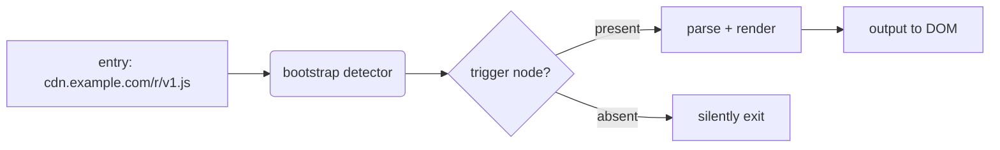

# Building a CDN-friendly engine

This is a template for technical blog posts. Replace this content with your actual writing.

## TL;DR

A self-bootstrapping JS engine that lives on a CDN should be:

- **Tiny**: under 50KB minified+gzipped, ideally under 25KB.
- **Self-contained**: zero runtime dependencies that aren't inlined.
- **Idempotent**: safe to load multiple times on the same page.

## Why this matters

> [!info] The 1MB myth
> Modern web apps treat 200-500KB JS as "small." But for a tool that runs on
> someone else's page, the budget is 10x tighter. You're a guest.

Press [[Cmd+Shift+P]] in Chrome DevTools, run "Show Coverage", and look at how
much of the JS your engine pulls in actually executes on first paint. If it's
less than 30%, your engine is too eager.

## Architecture

## Sizing budget

| Component | Goal | Worst case |
|---|---|---|
| Parser core | 20KB | 35KB |
| Default theme references | 0KB (CSS separate) | 0KB |
| Renderer | 8KB | 15KB |
| Total | < 30KB | < 50KB |

## The compression formula

For a payload of `n` characters with information density `d`:

$$
\text{compressed size} \approx \frac{n \cdot \log_2(d)}{8}
$$

Real-world JS achieves about $d \approx 4$ for unminified code, and $d \approx 8$
for minified. So minification roughly halves output.

## Color tokens

Brand uses #0969da for links and #ff6b35 for accents. Keep accent under 5% of
the visible UI.

## Conclusion

> [!success] Design checklist
> 1. Find a single trigger node (e.g. `#x-source`)
> 2. Exit silently if absent — be a quiet guest
> 3. Inline only the interpreter, not data
> 4. Prefer `defer` script for non-blocking load

Press [[Esc]] to stop reading.
