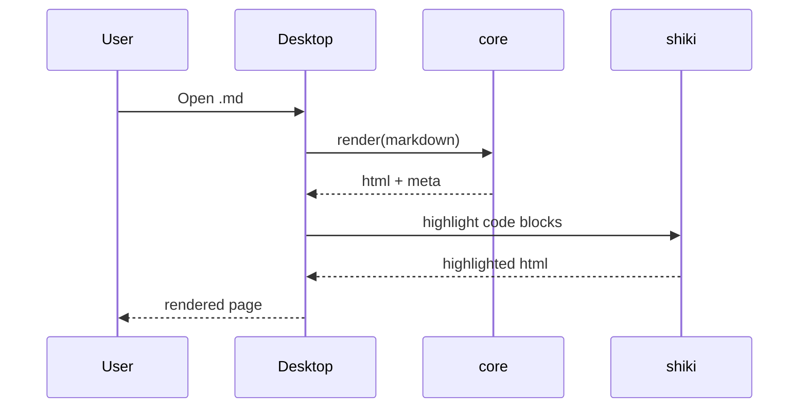
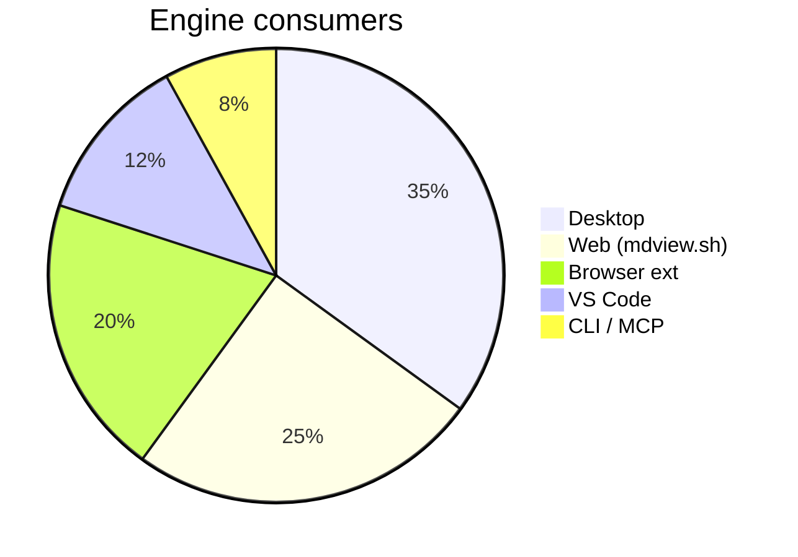

# mdview Demo

This single document exercises every mdview feature. If something on this page renders incorrectly, that's a bug.

## Typography

### Inline elements

Plain text with **strong**, *emphasis*, ***both***, ~~strikethrough~~, `inline code`, and a [link](https://mdview.sh).

A keyboard shortcut: <kbd>⌘ + K</kbd>. A subscript: H<sub>2</sub>O. A superscript: E = mc<sup>2</sup>.

### Quotes

> "Make Markdown look the way you want."
>
> A reader-first home for Markdown.

### Lists

Unordered:

- One
- Two
  - Two-A
  - Two-B
- Three

Ordered:

1. First
2. Second
3. Third

Task list:

- [x] Render
- [x] Theme
- [ ] Edit
- [ ] Sync

## Code

Inline `const x = 1`.

```typescript
// TypeScript with shiki highlighting
interface User {
  id: number;
  name: string;
}

function greet(user: User): string {
  return `Hello, ${user.name}!`;
}
```

```rust
fn main() {
  let greeting = "Hello from Rust";
  println!("{}", greeting);
}
```

```python
def fib(n):
    a, b = 0, 1
    while a < n:
        yield a
        a, b = b, a + b
```

## Tables

| Feature       | Status | Phase   |
| ------------- | ------ | ------- |
| Engine        | ✅     | Phase 0 |
| Desktop       | ✅     | Phase 1 |
| Web preview   | ✅     | Phase 2 |
| Browser ext   | ✅     | Phase 4 |
| MCP           | ✅     | Phase 6 |
| Marketplace   | ⏳     | Phase 5 |

## Callouts (mdv:callout)

> [!note] Note
> This is a note callout — useful for casual asides.

> [!tip] Pro tip
> Press `⌘\` to cycle through Read / Split / Source view modes in the desktop app.

> [!warning] Be careful
> The mdview engine sanitizes output, but a malicious Markdown source can still try to confuse you with deceptive links. Hover before clicking.

> [!danger] Don't do this
> Never embed `<script>` tags in your `.mdv.html` source. They'll be stripped by sanitize, but the content stops being portable.

> [!info] Info
> All eleven built-in callout types are supported: note, tip, success, info, warning, danger, caution, important, question, quote, example.

## Colors (mdv:color)

mdview's `mdv:color` extension turns hex literals into mini swatches:

The brand uses #0969da and #ff6b35. Long form: #1f6febff (with alpha). Short form: #fff and #f0a.

## Math (mdv:math)

Inline math: $E = mc^2$, the Pythagorean theorem $a^2 + b^2 = c^2$, and a definite integral $\int_0^1 x^2\,dx = \frac{1}{3}$.

Block math:

$$
f(x) = \int_{-\infty}^{\infty} \hat{f}(\xi) \, e^{2\pi i \xi x} \, d\xi
$$

A multiline block:

$$
\begin{aligned}
\nabla \cdot \vec{E} &= \frac{\rho}{\varepsilon_0} \\
\nabla \cdot \vec{B} &= 0 \\
\nabla \times \vec{E} &= -\frac{\partial \vec{B}}{\partial t} \\
\nabla \times \vec{B} &= \mu_0 \vec{J} + \mu_0 \varepsilon_0 \frac{\partial \vec{E}}{\partial t}
\end{aligned}
$$

## Diagrams (mdv:mermaid)

A flowchart:

```mermaid
flowchart LR
  A[.md source] --> B(@mdview/core)
  B --> C{Form?}
  C -->|progressive| D[.mdv.html]
  C -->|read| E[Desktop]
  C -->|stream| F[mdview.sh]
```

A sequence diagram:



A pie chart:



## Images


Images are responsive — try resizing the window.

## Horizontal rule

---

Above this line is the body. Below is a footer.

## Footer

You've reached the end of the demo. Now go [build something with mdview](https://github.com/mdview-sh/mdview).
