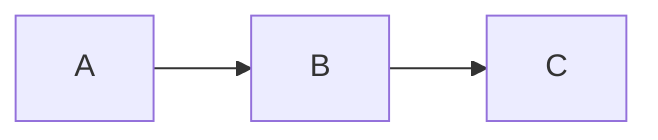

# Extensions

mdview ships 9 built-in extensions. Enable per-document via front matter:

```yaml
---
extensions:
  - mdv:color
  - mdv:callout
  - mdv:math
  - mdv:mermaid
  - mdv:kbd
  - mdv:details
  - mdv:sub-sup
  - mdv:badge
  - mdv:progress
---
```

> [!tip] Enable only what you use
> Each extension adds parsing time. Documents without math/mermaid don't need to load KaTeX/mermaid libraries.

## `mdv:color` — hex color swatches

Hex literals get a small swatch preview. Useful for design / branding documents.

| Syntax      | Example   |
| ----------- | --------- |
| `#rgb`      | #f0a      |
| `#rrggbb`   | #0969da   |
| `#rrggbbaa` | #ff6b35cc |

Inline `<code>` blocks are not affected.

## `mdv:callout` — Obsidian-style admonitions

```markdown
> [!warning] Heads up
> Body content with **markdown**.
```

> [!warning] Heads up
> Body content with **markdown**.

Built-in types: `note` `tip` `success` `info` `warning` `danger` `caution` `important` `question` `quote` `example`. Unknown types render with a generic style.

## `mdv:math` — KaTeX inline + block

```markdown
Inline: $E = mc^2$
Block:

$$
\nabla \cdot \vec{E} = \frac{\rho}{\varepsilon_0}
$$
```

Core emits placeholder markup. Consumers (desktop / Web / browser ext) hydrate KaTeX on the client (lazy-loaded).

## `mdv:mermaid` — flow / sequence / pie charts

````markdown

````

Same hydrate pattern as math. mermaid 11 is loaded on-demand. **Note**: text containing `.`, `@`, `/` etc. should be quoted (`A["my.text"]`) — mermaid's flowchart parser is strict.

## `mdv:kbd` — keyboard shortcuts

```markdown
Press [[Cmd+K]] then [[g g]].
```

→ Press [[Cmd+K]] then [[g g]].

`+` separates simultaneously-pressed keys. A space in `[[...]]` means a sequential key chord. Supports Unicode modifier symbols (`⌘ ⌥ ⇧ ⌃ ⏎ ⌫ ⎋`).

## `mdv:details` — collapsible blocks

```markdown
::: details Click to expand
Hidden content.
:::
```

Renders to native `<details><summary>`. Inner content is parsed as Markdown.

## `mdv:sub-sup` — subscript / superscript

```markdown
H~2~O and E = mc^2^
```

Single-tilde for sub, single-caret for sup. Doesn't conflict with GFM `~~strikethrough~~` (double-tilde).

## `mdv:badge` — pill-shaped status badges

```markdown
![[badge:passing|green]] ![[badge:v1.0|blue]] ![[badge:custom|#ff6b35]]
```

→ ![[badge:passing|green]] ![[badge:v1.0|blue]] ![[badge:custom|#ff6b35]]

Named colors: `green`, `red`, `blue`, `gray`, `orange`, `yellow`, `purple`, `pink`. Or any hex.

## `mdv:progress` — inline progress bars

```markdown
CPU [==70%==] RAM [==45%==|red] Disk [==90%==|#ff6b35]
```

→ CPU [==70%==] RAM [==45%==|red] Disk [==90%==|#ff6b35]

Renders semantic `<span role="progressbar" aria-valuenow="...">`.

## Authoring third-party extensions

```ts
import { registerExtension } from '@mdview/core';

registerExtension('myorg:badge', (md) => {
  // standard markdown-it plugin code
});
```

See [Plugin Authoring Guide](./plugin-authoring.md) for full details and examples.

## Compatibility

- Unknown extension IDs in front matter are silently ignored (forward-compat)
- Disabled extensions render the source text as-is (no breakage)
- Extension output is sanitized via DOMPurify on consumer side; new extensions should output safe HTML
