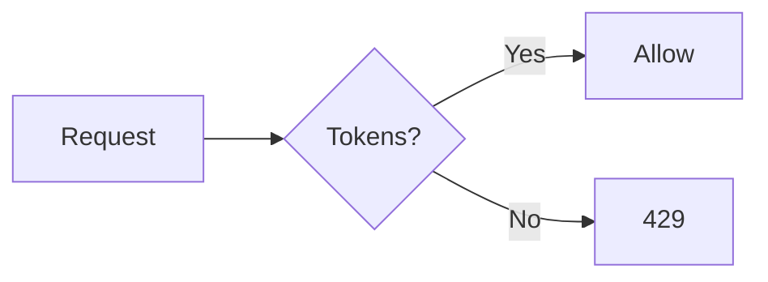

# mdview Beautifier

## When to use

Trigger any time the user wants a Markdown document that will be **read** or **shared**, not just dumped in chat. Concrete signals:

- "Write a report / blog post / readme / handbook in Markdown"
- "Make me a doc I can share"
- "Generate a .md file for X" (where X is content to publish)
- "I want a beautiful Markdown version"

Do NOT trigger this skill for one-shot snippets or code-comment-level Markdown.

## Required output shape

Every document this skill produces MUST start with mdview front matter using the
[mdview Metadata Schema v0.1](../../02-Format-Spec.md#34-元数据-schema--v01).

Minimum fields:

```yaml
---
mdview: 1
title: <document title>
theme: <pick: default | github | medium>
extensions: [<pick from: mdv:color, mdv:callout, mdv:math, mdv:mermaid>]
---
```

Recommended additional fields when relevant:

- `description` — for OG / preview cards
- `lang: zh-CN` — when the body is Chinese (or another language)
- `toc: true` — for documents with 4+ sections
- `readingTime: true` — for long-form posts
- `font: charter` and `theme: medium` — for long-form reading

## Theme picking guide

- `default` — neutral, technical docs, README
- `github` — README that should look exactly like a GitHub project page
- `medium` — long-form reading, blog post, essay

## Extension picking guide

- `mdv:callout` — when the document has notes / warnings / tips
- `mdv:color` — when content is about design / branding / color tokens
- `mdv:math` — when there are formulas
- `mdv:mermaid` — when there are diagrams (sequence, flow, gantt)

## Workflow

1. **Draft body content** in plain Markdown
2. **Decide theme + extensions** based on the guides above
3. **Wrap with front matter** at the top
4. **(Optional) export to .mdv.html** by calling the `mdview` MCP tool `export_mdv_html` with `{ markdown: <full document>, form: 'progressive', theme: <theme id> }`. Show the user where the file is saved.

## Example

User: "Write me a one-pager on rate limiting strategies."

Output:

```markdown
---
mdview: 1
title: Rate Limiting Strategies
description: A pragmatic comparison of token bucket, leaky bucket, fixed window, and sliding window.
theme: medium
font: charter
toc: true
readingTime: true
extensions:
  - mdv:callout
  - mdv:mermaid
---

# Rate Limiting Strategies

## Why this matters

> [!note] Audience
> This guide assumes you're operating an API at >1k QPS.

…

## Token bucket



## Comparison

| Strategy | Burst handling | Implementation cost |
| -------- | -------------- | ------------------- |
| …        | …              | …                   |
```

After producing the markdown, offer to export it: "Want me to save this as a
shareable `.mdv.html` file? Just say yes."

## Constraints

- Do NOT include third-party CDN tags inside the body
- Do NOT manually write inline `<div class="mdv-...">` — let the engine produce them
- Keep body content valid CommonMark + mdview extension syntax only
- Never write malformed YAML in front matter
